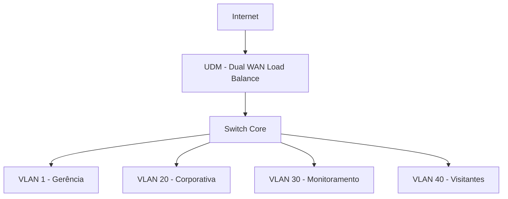

# infra-modelo-unifi

Repositório com configurações e exemplos técnicos para simulação e organização de ambientes UniFi em laboratório. Nenhum dado real de ambiente de produção é utilizado aqui.

## Objetivo
Disponibilizar exemplos organizados de:
- Configuração de VLANs
- Redes com e sem NAT
- Boas práticas de segmentação
- Simulação de estruturas de rede usando nomenclatura genérica
- Configuração de conexão com dupla WAN

## Estrutura
```
infra-modelo-unifi/
├── README.md
├── vlan/
│   └── exemplo_config_vlan.txt
├── redes/
│   └── exemplo_sem_nat.txt
├── controle/
│   ├── boas_praticas_unifi.txt
│   └── config_internet_dualwan.txt
└── docs/
    └── estrutura_rede_exemplo.md
```

## Uso
Este repositório pode ser utilizado para:
- Treinamento pessoal
- Demonstração técnica em publicações
- Criação de base de conhecimento interna

## Observações
- Todos os dados são genéricos, simulados e sem vínculo com qualquer organização real.
- Não usar esse repositório para ambientes reais de produção.

---

Criado por João Alberto Ribeiro Deniz Junior como base pública de organização e boas práticas em redes UniFi.

---

### docs/estrutura_rede_exemplo.md

```
Topologia Lógica - Estrutura Simulada UniFi
Topologia Lógica - Estrutura Simulada UniFi

1. Camadas da Infraestrutura:
   - **Gerenciamento**: VLAN 1 (10.100.100.0/25) exclusiva para switches, APs e dispositivos de controle, com IPs estáticos.
   - **Acesso Corporativo**: VLAN 20 (10.200.20.0/24), destinada a notebooks, telefones IP e estações de trabalho.
   - **Monitoramento**: VLAN 30 (10.200.30.0/23), destinada a câmeras, gravadores e sensores.
   - **Convidados/Dispositivos Externos**: VLAN 40 (10.200.40.0/22), para visitantes, fornecedores e dispositivos não confiáveis.

2. Conexões WAN:
   - UDM com WAN1 e WAN2 configuradas em balanceamento de carga 50/50.
   - Cada rede pode acessar a internet conforme política definida (ex: sem NAT para visitantes).

3. Barramentos e Roteamento:
   - As VLANs estão associadas a um switch core com ACLs definidas.
   - Todo tráfego é filtrado por perfil de porta, tags de VLAN e regras de firewall.
   - Dispositivos de diferentes redes não se comunicam diretamente.

4. Wi-Fi e SSIDs:
   - SSIDs diferentes por finalidade (ex: "CopaCorp", "BaseMonitor", "VisitantesCT")
   - Cada SSID vinculado à sua respectiva VLAN.

5. Considerações:
   - O design visa clareza, segurança e escalabilidade.
   - A arquitetura pode ser replicada em ambientes corporativos, esportivos ou educacionais.


6. Diagrama ASCII:

    [ Internet ]
         |
 +------------------+
 |   UDM (GW LB)    |
 +--------+---------+
          |
   +------+------+
   |  Switch Core |
   +--+--+--+--+--+
      |  |  |  |
      |  |  |  +--> VLAN 40 (Visitantes)
      |  |  +-----> VLAN 30 (Monitoramento)
      |  +--------> VLAN 20 (Corporativa)
      +-----------> VLAN 1 (Gerência)

7. Diagrama Mermaid (renderizável no GitHub):


